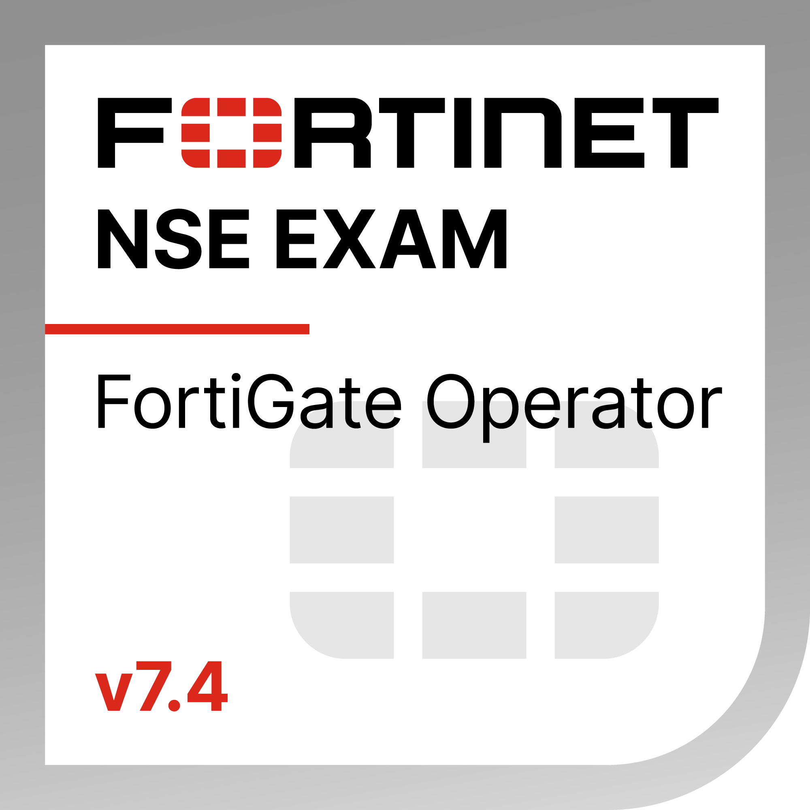

# 📄 Narain Karthik Jayakumar — Portfolio  

  
  
  
  
   
  
  
  

  
📧 **Email:** narainjkans@hotmail.com  

---

## 🎓 Education

- **M.Sc. Cyber Security** — Bharathiar University *(July 2023 - April 2025)*
- **B.Voc. Information Technology** — Bishop Heber College *(March 2020 - March 2023)* — *Grade: 85%*

---

## 🛡️ Main Domains

- **Network Engineer & Security**
- **Cyber Security Analyst — Defensive**

---

## 🏆 Certifications

- **Certified Network Security Practitioner (CNSP)** — The SecOps Group *(Issued June 2024)*  
  `Credential ID: 8825337`
- **Fortinet NSE Level 1: Certified Associate** *(Issued July 2024 - Expires July 2026)*  
  `Credential ID: 3018494892NJ`
- **Fortinet NSE Level 2: Certified Associate** *(Issued July 2024 - Expires July 2026)*  
  `Credential ID: 6976778724NJ`

---

## 💼 Experience

### Network Infrastructure Analyst — *Internship*  
**Surprise Furniture** *(Aug 2024 – Oct 2024 | Coimbatore, Tamil Nadu)*  
- Performed network infrastructure assessments and firewall configuration discovery.
- Proposed cloud migration strategies with pricing and implementation plans.
- Developed a duplicate file analyzer to optimize data management processes.

### Freelance Software Developer  
*(Jan 2025 – Present | Remote, Tamil Nadu)*  
- Building custom software and websites based on client requirements.
- Specializing in problem analysis and crafting tailored solutions.

### System Administrator  
**GTN Engineering (India) Ltd.** *(May 2025 – Present | Coimbatore, Tamil Nadu)*  

---

## 🚀 Projects

### 🔍 Duplicate File Finder Pro v1.0
- Cross-platform tool (Windows/Linux) to efficiently detect and manage duplicate files.
- Features: Smart sorting, metadata display, secure deletion, and real-time progress tracking.

### 📚 Library Management System — *Freelance Project*
- Developed for **Shrimati Indira Gandhi College**, Tiruchirappalli, Tamil Nadu.
- Features: Admin login, member management, book inventory, issue/return tracking, email alerts, PDF reports.

**Tech Stack:**  
`HTML`, `CSS`, `Python (Flask)`, `Microsoft SQL Server 2008`, `SMTP`, `ReportLab`

### 🛡️ Byte Find
- An open-source information-gathering and security assessment tool.
- Features: Domain/IP reconnaissance, web scanning, network vulnerability scanning, and Google dorking.

---

> "Always learning. Always growing. Always securing." 🔒✨
